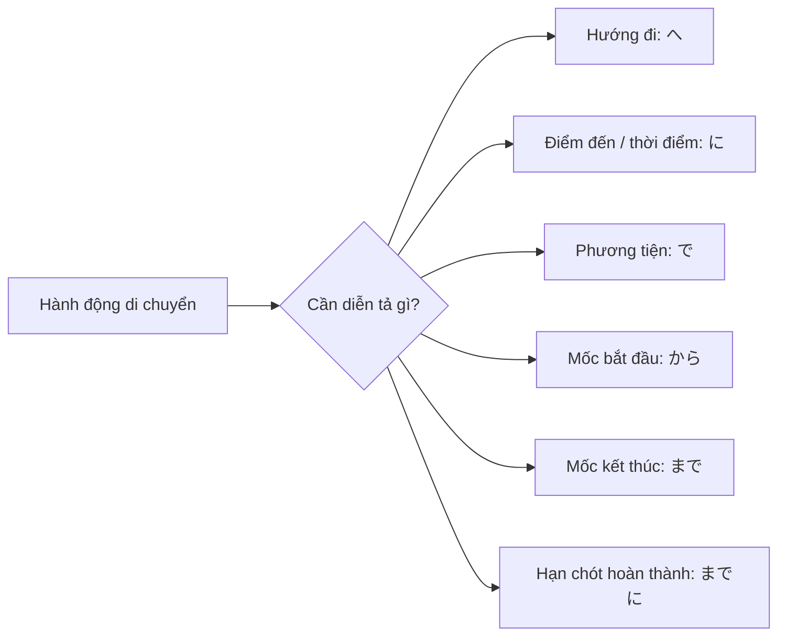
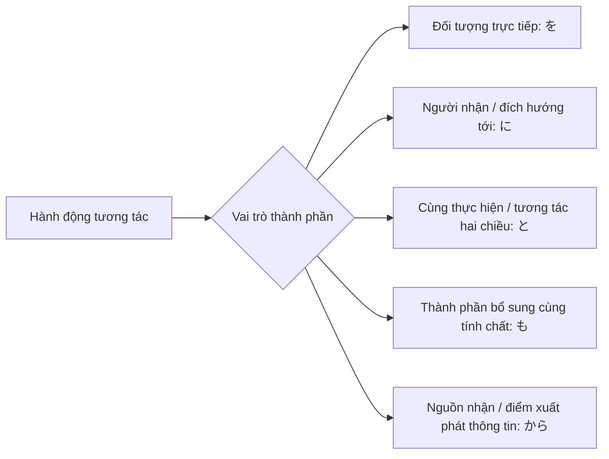
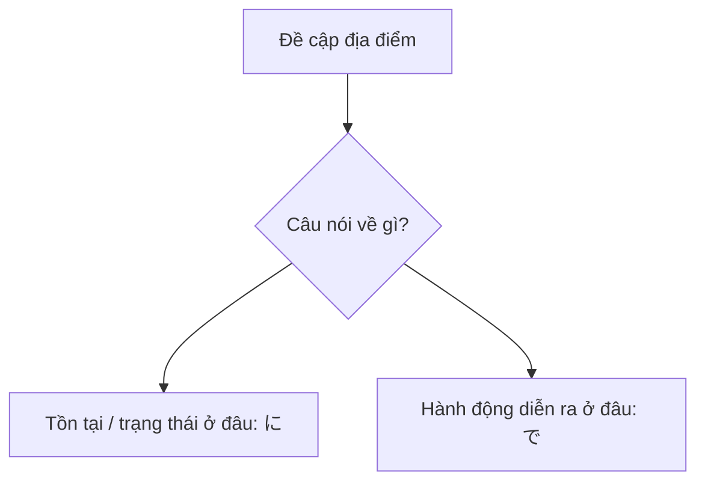
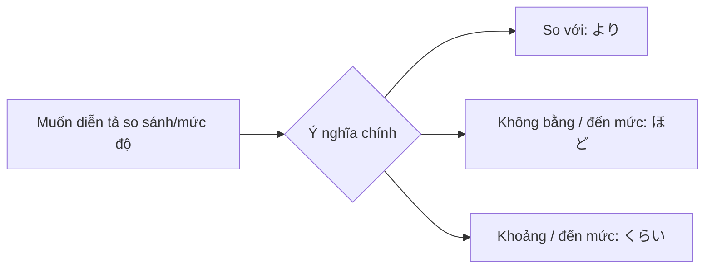
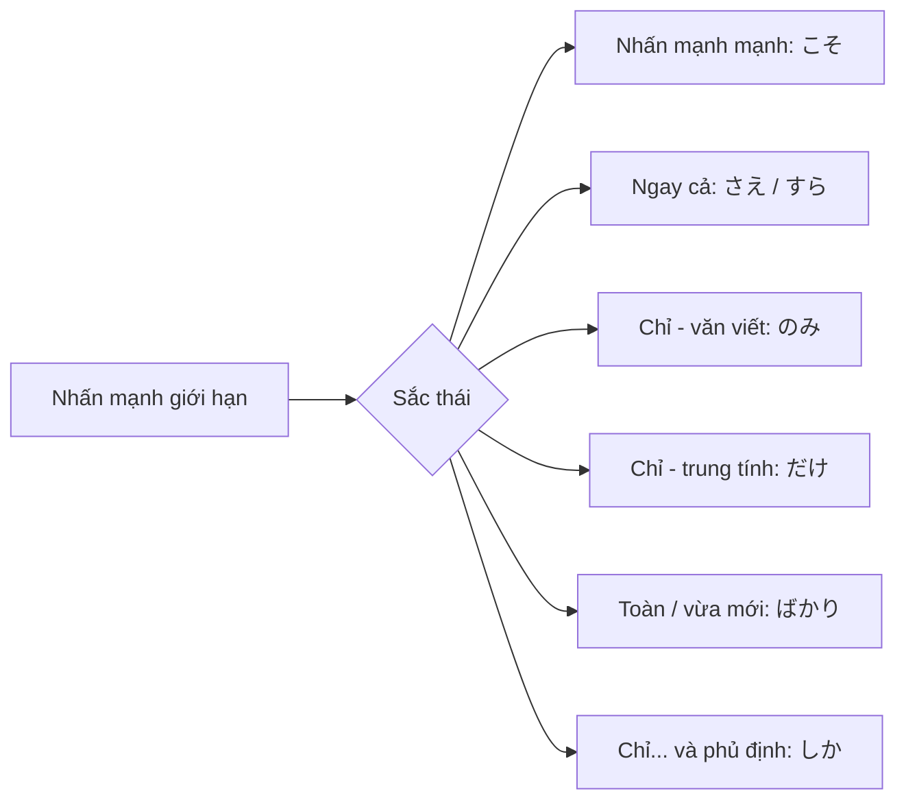
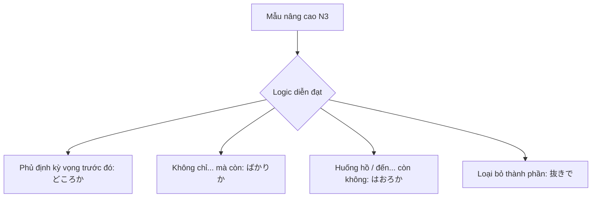
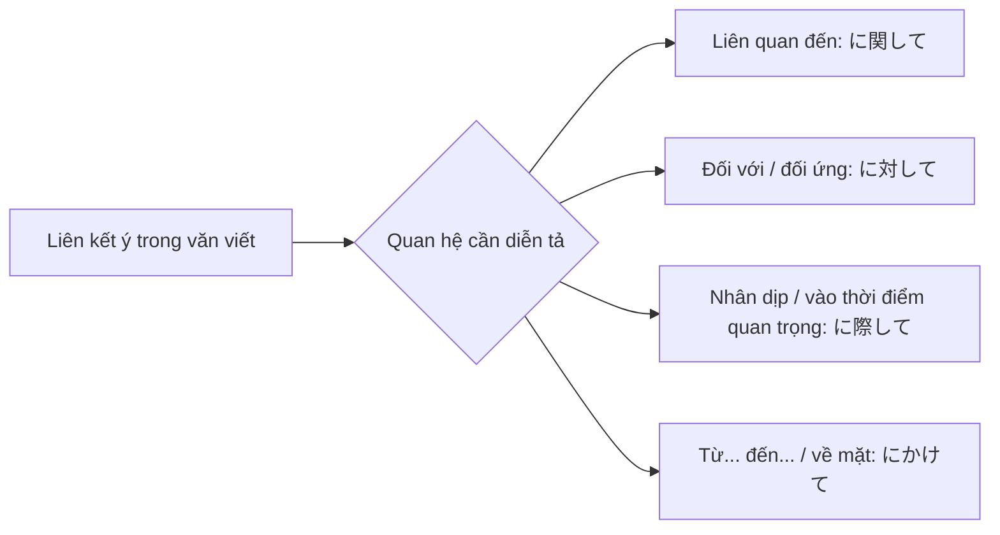

# CẨM NANG CHINH PHỤC TRỢ TỪ VÀ CHIA THỂ TIẾNG NHẬT (N5 - N3)

## Lời mở đầu

Cuốn sách này được xây dựng dành cho người học từ trình độ sơ cấp đến trung cấp thấp, đặc biệt phù hợp với người đang ôn thi JLPT N5, N4 và N3. Trọng tâm của sách là hai mảng kiến thức khiến người học dễ nhầm nhất:

- Trợ từ: vì chỉ cần dùng sai một trợ từ là quan hệ giữa các thành phần trong câu thay đổi hoàn toàn.
- Chia thể động từ: vì chỉ cần chia sai một thể là sắc thái, mức độ lịch sự hoặc ý nghĩa của câu sẽ không còn chính xác.

Điểm khác biệt của sách là không học trợ từ theo kiểu liệt kê rời rạc, mà học theo ngữ cảnh hành động:

**Làm gì -> Ở đâu -> Bằng gì -> Với ai -> Từ đâu -> Đến đâu -> Trước khi nào**

Khi nắm được sơ đồ này, người học sẽ dễ nhìn ra tại sao cùng là một câu nhưng chỗ này dùng に, chỗ kia lại dùng で; lúc này dùng から, lúc khác lại dùng までに.

Mỗi chương đều gồm 6 phần:

1. Mục tiêu bài học
2. Kiến thức cốt lõi
3. Ví dụ phân tích
4. Lỗi thường gặp
5. Bài tập luyện tập
6. Đối chiếu đáp án (xem ở phụ lục cuối sách)

---

## PHẦN 1: TRỢ TỪ THEO NGỮ CẢNH HÀNH ĐỘNG (N5 - N4)

### Cách học của phần này

Khi gặp một câu tiếng Nhật, hãy tự hỏi theo thứ tự sau:

1. Hành động chính là gì?
2. Hành động diễn ra ở đâu?
3. Hướng đến đâu hay xảy ra vào thời điểm nào?
4. Dùng công cụ gì?
5. Tương tác với ai?
6. Bắt đầu từ đâu và kết thúc ở đâu?

Nếu trả lời được 6 câu hỏi này, bạn sẽ chọn trợ từ chính xác hơn rất nhiều.

---

## Chương 1: Nhóm Di chuyển và Thời gian

### 1. Mục tiêu bài học

Sau chương này, người học có thể:

- Phân biệt へ và に khi nói về hướng đi, điểm đến.
- Dùng で cho phương tiện di chuyển.
- Dùng から, まで, までに để diễn tả mốc bắt đầu, kết thúc và hạn chót.

### 2. Kiến thức cốt lõi

#### 2.1. Trợ từ へ

へ nhấn vào hướng đi, phương hướng, đích hướng tới. Nó thường xuất hiện với các động từ di chuyển như 行きます, 来ます, 帰ります.

Ví dụ:

- 日本へ行きます。: Tôi đi sang Nhật.
- 学校へ来てください。: Hãy đến trường.

Ghi nhớ nhanh: へ trả lời cho câu hỏi “đi về phía đâu?”.

#### 2.2. Trợ từ に

に trong nhóm này thường chỉ điểm đến cụ thể hoặc thời điểm cụ thể.

Ví dụ chỉ điểm đến:

- うちに帰ります。: Tôi về nhà.
- 東京に着きました。: Tôi đã đến Tokyo.

Ví dụ chỉ thời gian:

- 7時に起きます。: Tôi dậy lúc 7 giờ.
- 日曜日に勉強します。: Tôi học vào Chủ nhật.

Ghi nhớ nhanh: に trả lời cho “đến đúng đâu?” hoặc “vào đúng lúc nào?”.

#### 2.3. Phân biệt へ và に

- へ: nhấn vào hướng đi.
- に: nhấn vào điểm đến cụ thể.

So sánh:

- 日本へ行きます。: Đi về phía Nhật Bản.
- 日本に行きます。: Đi đến Nhật Bản.

Trong giao tiếp hằng ngày, hai cách này nhiều lúc thay thế cho nhau được. Tuy nhiên, khi muốn dạy người học nền tảng chắc, nên hiểu sự khác nhau về trọng tâm nghĩa.

#### 2.4. Trợ từ で

で trong chương này chủ yếu dùng để chỉ phương tiện, cách thức.

Ví dụ:

- 電車で会社へ行きます。: Tôi đi đến công ty bằng tàu điện.
- バスで学校に行きます。: Tôi đi học bằng xe buýt.

Lưu ý: đi bộ thường dùng 歩いて, hoặc đôi khi dùng 徒歩で trong văn viết.

#### 2.5. Trợ từ から

から chỉ điểm bắt đầu về không gian hoặc thời gian.

Ví dụ:

- 9時から授業が始まります。: Tiết học bắt đầu từ 9 giờ.
- ベトナムから日本へ来ました。: Tôi đã đến Nhật từ Việt Nam.

#### 2.6. Trợ từ まで

まで chỉ điểm kết thúc.

Ví dụ:

- 5時まで働きます。: Tôi làm việc đến 5 giờ.
- 駅まで歩きます。: Tôi đi bộ đến ga.

#### 2.7. Trợ từ までに

までに diễn tả hạn chót, nghĩa là “trước”, “muộn nhất là đến”. Hành động phải hoàn thành trước mốc đó.

Ví dụ:

- 8時までに来てください。: Hãy đến trước 8 giờ.
- 金曜日までにレポートを出します。: Tôi sẽ nộp báo cáo trước thứ Sáu.

So sánh:

- 5時まで勉強します。: Học đến 5 giờ.
- 5時までに宿題をします。: Làm xong bài tập trước 5 giờ.

### 3. Mẫu câu trọng tâm

- Địa điểm xuất phát + から + địa điểm đích + へ/に + động từ di chuyển
- Thời gian bắt đầu + から + thời gian kết thúc + まで
- Hạn chót + までに + hành động hoàn thành
- Phương tiện + で + động từ di chuyển

### 4. Ví dụ phân tích

1. 毎朝、7時に家を出て、電車で会社へ行きます。
	 - 7時に: thời điểm cụ thể
	 - 電車で: phương tiện
	 - 会社へ: hướng đến nơi làm việc

2. 会議は3時から4時までです。
	 - 3時から: bắt đầu từ 3 giờ
	 - 4時まで: kết thúc ở 4 giờ

3. 明日までにこのメールに返信してください。
	 - 明日までに: hạn chót là ngày mai

### 5. Lỗi thường gặp

- Dùng まで thay cho までに khi muốn nói hạn nộp.
- Dùng に cho mọi trường hợp di chuyển mà không hiểu sắc thái hướng đi của へ.
- Nhầm で chỉ nơi xảy ra hành động với で chỉ phương tiện. Dù cùng là で, hai chức năng này phải nhận ra qua ngữ cảnh.

### 6. Bài tập

#### Bài 1: Điền trợ từ thích hợp

1. 毎日、バス___学校___行きます。
2. 授業は8時___始まります。
3. ベトナム___日本___来ました。
4. レポートは明日___出してください。
5. 駅___歩きます。

#### Bài 2: Chọn まで hay までに

1. 6時___仕事をします。
2. 6時___会社に来てください。
3. 今月の終わり___この本を読みます。
4. 今月の終わり___申込書を出します。

### 7. Đáp án

Đáp án chương này được chuyển về phần "Phụ lục đáp án cuối sách" để tiện dùng làm giáo trình.

---

## Chương 2: Nhóm Tương tác và Đối tượng

### 1. Mục tiêu bài học

- Dùng đúng を cho tân ngữ trực tiếp.
- Dùng に với người nhận hoặc đối tượng hướng tới.
- Dùng と cho cùng làm với ai hoặc trích dẫn, tương tác song phương.
- Hiểu も là “cũng”.
- Hiểu から là “từ” khi nhận, lấy thông tin hay vật từ ai đó.

### 2. Kiến thức cốt lõi

#### 2.1. Trợ từ を

を đánh dấu đối tượng chịu tác động trực tiếp của hành động.

Ví dụ:

- 本を読みます。: Đọc sách.
- パンを食べます。: Ăn bánh mì.
- 日本語を勉強します。: Học tiếng Nhật.

#### 2.2. Trợ từ に trong nhóm tương tác

に chỉ người nhận, nơi hành động hướng tới, hoặc đối tượng chịu tác động gián tiếp.

Ví dụ:

- 先生に聞きます。: Hỏi giáo viên.
- 友だちにメールを送ります。: Gửi mail cho bạn.
- 母にプレゼントをあげます。: Tặng quà cho mẹ.

#### 2.3. Trợ từ と

と chỉ người cùng thực hiện hành động hoặc đối tượng tương tác theo quan hệ hai chiều.

Ví dụ:

- 友だちと話します。: Nói chuyện với bạn.
- 家族と旅行します。: Đi du lịch cùng gia đình.
- 田中さんと結婚しました。: Kết hôn với anh/chị Tanaka.

#### 2.4. Trợ từ も

も mang nghĩa “cũng”, dùng để thêm một đối tượng có cùng tính chất với điều vừa nêu.

Ví dụ:

- 私はコーヒーを飲みます。姉も飲みます。
- 日本語も英語も勉強しています。

#### 2.5. Trợ từ から

から chỉ nguồn nhận hoặc nơi, người xuất phát của vật hay thông tin.

Ví dụ:

- 友だちから手紙をもらいました。: Tôi nhận thư từ bạn.
- 先生から説明を聞きました。: Tôi nghe giải thích từ giáo viên.

### 3. Phân biệt nhanh các mẫu dễ nhầm

- 先生に聞く: hỏi giáo viên
- 先生と話す: nói chuyện với giáo viên
- 友だちに会う: gặp bạn
- 友だちと遊ぶ: chơi cùng bạn

Ghi nhớ:

- Nếu hành động “chĩa tới” ai đó: ưu tiên nghĩ đến に.
- Nếu hành động “cùng với” ai đó: ưu tiên nghĩ đến と.

### 4. Ví dụ phân tích

1. 私は先生に質問をしました。
	 - 先生に: người nhận câu hỏi
	 - 質問をしました: thực hiện hành động hỏi

2. 昨日、友だちと映画を見ました。
	 - 友だちと: xem cùng bạn
	 - 映画を: đối tượng được xem

3. 父から時計をもらいました。
	 - 父から: nhận từ bố

### 5. Lỗi thường gặp

- Nói 先生と聞きます thay vì 先生に聞きます.
- Nói 友だちに話します khi ý là “nói chuyện cùng bạn”. Trường hợp này thường là 友だちと話します.
- Bỏ mất を khi nói câu có tân ngữ trực tiếp.

### 6. Bài tập

#### Bài 1: Điền trợ từ

1. 友だち___プレゼント___あげました。
2. 私は先生___日本語___聞きました。
3. 昨日、家族___レストラン___行きました。
4. 兄___本をもらいました。
5. 私はお茶を飲みます。母___飲みます。

#### Bài 2: Phân biệt に hay と

1. 田中さん___電話します。
2. 田中さん___食事します。
3. 部長___報告します。
4. 部長___相談します。

### 7. Đáp án

Đáp án chương này được chuyển về phần "Phụ lục đáp án cuối sách" để tiện dùng làm giáo trình.

---

## Chương 3: Nhóm Vị trí và Sự tồn tại

### 1. Mục tiêu bài học

- Phân biệt chắc chắn に và で khi nói về địa điểm.
- Dùng đúng あります và います.
- Hiểu tư duy: に là điểm tồn tại, で là nơi hành động diễn ra.

### 2. Kiến thức cốt lõi

#### 2.1. に: nơi có sự tồn tại

に được dùng khi một người hoặc vật “ở”, “tồn tại”, “xuất hiện” tại một nơi.

Ví dụ:

- 教室に学生がいます。: Trong lớp có học sinh.
- 机の上に本があります。: Trên bàn có sách.
- 公園に子どもがいます。: Ở công viên có trẻ em.

#### 2.2. で: nơi hành động diễn ra

で dùng cho địa điểm nơi một hành động được thực hiện.

Ví dụ:

- 教室で勉強します。: Học ở lớp.
- 図書館で本を読みます。: Đọc sách ở thư viện.
- 公園で遊びます。: Chơi ở công viên.

### 3. Công thức tư duy

- Có cái gì, ai đó ở đâu -> に
- Làm hành động gì ở đâu -> で

So sánh:

- レストランに田中さんがいます。: Anh Tanaka đang ở nhà hàng.
- レストランで田中さんと食事します。: Tôi ăn cùng anh Tanaka ở nhà hàng.

### 4. Mở rộng nâng cao

Một số động từ không chỉ là “hành động đơn thuần” mà có tính chất “xuất hiện” hoặc “đặt vào vị trí”, nên thường đi với に:

- いすに座ります。: Ngồi xuống ghế.
- 机に置きます。: Đặt lên bàn.
- 東京に住んでいます。: Sống ở Tokyo.

Lý do là trọng tâm của những câu này là vị trí đích hoặc trạng thái tồn tại sau hành động.

### 5. Ví dụ phân tích

1. 机の上にパソコンがあります。
	 - に đánh dấu nơi laptop tồn tại.

2. 机の上でご飯を食べます。
	 - で đánh dấu nơi hành động ăn xảy ra.

3. 母はいま台所にいます。
	 - に vì là trạng thái hiện diện.

4. 母は台所で料理しています。
	 - で vì là hành động nấu ăn.

### 6. Lỗi thường gặp

- Nói 図書館に勉強します.
- Nói 部屋で猫がいます.
- Không nhận ra các động từ như 住む, 座る, 置く nghiêng về vị trí đích nên hay đi với に.

### 7. Bài tập

#### Bài 1: Chọn に hay で

1. へや___だれもいません。
2. へや___日本語を勉強します。
3. いす___座ってください。
4. スーパー___野菜を買います。
5. かばん___財布があります。

#### Bài 2: Sửa lỗi câu sai

1. 公園にサッカーをします。
2. 教室で学生がいます。
3. 東京で住んでいます。

### 8. Đáp án

Đáp án chương này được chuyển về phần "Phụ lục đáp án cuối sách" để tiện dùng làm giáo trình.

### Bài đọc ngắn cuối PHẦN 1

Mai là du học sinh mới sang Nhật. Mỗi sáng, Mai đi từ ký túc xá đến trường bằng tàu điện. Lớp học của Mai bắt đầu từ 9 giờ và kết thúc lúc 12 giờ. Chiều nay, giáo viên yêu cầu cả lớp nộp bài tập trước 5 giờ. Mai dự định về ký túc xá sớm để hoàn thành bài đúng hạn.

#### Câu hỏi nhanh

1. Mai đi học bằng phương tiện gì?
2. Lớp học bắt đầu và kết thúc khi nào?
3. Hạn nộp bài tập là mấy giờ?

---

## Chương 4: Nhóm So sánh và Mức độ cơ bản

### 1. Mục tiêu bài học

- Dùng được より để chỉ chuẩn so sánh.
- Dùng được ほど để chỉ mức độ hoặc phủ định so sánh.
- Dùng được くらい để chỉ mức độ, khoảng lượng gần đúng.

### 2. Kiến thức cốt lõi

#### 2.1. より

より mang nghĩa “so với”, “hơn”.

Ví dụ:

- 日本語は英語より難しいです。: Tiếng Nhật khó hơn tiếng Anh.
- 電車はバスより速いです。: Tàu điện nhanh hơn xe buýt.

#### 2.2. ほど

ほど có hai cách dùng chính ở giai đoạn này.

Một là dùng với phủ định để nói “không đến mức bằng”.

- 今年は去年ほど寒くありません。: Năm nay không lạnh bằng năm ngoái.

Hai là dùng để diễn tả mức độ “đến mức”.

- 歩けないほど疲れました。: Tôi mệt đến mức không đi nổi.

#### 2.3. くらい

くらい chỉ mức độ gần đúng hoặc “đến mức”.

Ví dụ:

- 30分くらい待ちました。: Tôi đã đợi khoảng 30 phút.
- 子どもでもできるくらい簡単です。: Đơn giản đến mức trẻ con cũng làm được.

### 3. So sánh nhanh ほど và くらい

Ở nhiều trường hợp, ほど và くらい đều có thể dịch là “đến mức”, nhưng:

- ほど thường mang cảm giác văn viết hoặc nhấn mức độ rõ hơn.
- くらい gần khẩu ngữ hơn và còn dùng cho lượng gần đúng.

### 4. Cấu trúc quan trọng

- A は B より + tính từ
- A は B ほど + phủ định
- Số lượng/thời gian + くらい
- Động từ thể từ điển/ない + ほど, くらい

### 5. Ví dụ phân tích

1. 私は弟より背が高いです。
2. この問題は思ったほど難しくありません。
3. 昨日は3時間くらい勉強しました。

### 6. Lỗi thường gặp

- Dùng ほど trong câu khẳng định so sánh cơ bản thay cho より.
- Nhầm くらい chỉ mức độ với ぐらい. Thực tế hai cách này tương đương trong nhiều trường hợp, nhưng nên thống nhất một cách trong sách để người học đỡ loạn.

### 7. Bài tập

#### Bài 1: Điền trợ từ thích hợp

1. 兄は私___背が高いです。
2. この店はあの店___高くありません。
3. 昨日は2時間___昼寝しました。
4. 立てない___疲れました。

#### Bài 2: Dịch sang tiếng Nhật

1. Món này ngon hơn món kia.
2. Bộ phim này không thú vị bằng quyển sách đó.
3. Tôi học khoảng 1 tiếng.

### 8. Đáp án

Đáp án chương này được chuyển về phần "Phụ lục đáp án cuối sách" để tiện dùng làm giáo trình.

### Bài đọc ngắn cuối PHẦN 2

Anh Nam làm thêm ở quán cà phê. Hôm qua, quản lý bảo Nam viết lại bảng thông báo bằng tiếng Nhật. Ban đầu Nam không tự tin, nhưng sau khi luyện tập nhiều, anh đã có thể viết nhanh hơn và ít sai hơn. Cuối tuần này, Nam định học thêm để chuẩn bị cho kỳ thi N4.

#### Câu hỏi nhanh

1. Quản lý đã yêu cầu Nam làm gì?
2. Năng lực của Nam đã thay đổi thế nào sau khi luyện tập?
3. Cuối tuần Nam dự định làm gì?

---

## PHẦN 2: HỆ THỐNG CHIA THỂ ĐỘNG TỪ (N5 - N4)

### Cách tiếp cận của phần này

Muốn chia động từ nhanh, trước hết phải xác định đúng nhóm động từ.

- Nhóm 1: Động từ đuôi う chuyển âm theo quy tắc.
- Nhóm 2: Động từ thường kết thúc bằng る, bỏ る rồi thêm đuôi mới.
- Nhóm 3: する, 来る.

Mẹo gốc:

- Nếu là nhóm 1, hãy nhớ bảng đổi âm hàng う.
- Nếu là nhóm 2, thường chỉ cần bỏ る.
- Nếu là nhóm 3, bắt buộc thuộc lòng dạng đặc biệt.

---

## Chương 5: Các thể nền tảng N5

### 1. Mục tiêu bài học

- Hiểu và dùng được thể từ điển, ます, て, ない, た.
- Biết cách đổi giữa các thể nhanh chóng.

### 2. Bảng nền tảng

| Thể | Ý nghĩa chính | Ví dụ với 食べる | Ví dụ với 書く |
|---|---|---|---|
| Từ điển | dạng gốc | 食べる | 書く |
| ます | lịch sự hiện tại/tương lai | 食べます | 書きます |
| て | nối câu, yêu cầu, tiếp diễn | 食べて | 書いて |
| ない | phủ định thường | 食べない | 書かない |
| た | quá khứ thường | 食べた | 書いた |

### 3. Cách chia nhanh

#### 3.1. Thể ます

- Nhóm 1: đổi âm cuối sang hàng い + ます
	- 書く -> 書きます
	- 飲む -> 飲みます
- Nhóm 2: bỏ る + ます
	- 食べる -> 食べます
- Nhóm 3:
	- する -> します
	- 来る -> 来ます

#### 3.2. Thể て và thể た

Nhóm 1 cần học theo cụm âm cuối:

- う, つ, る -> って / った
- む, ぶ, ぬ -> んで / んだ
- く -> いて / いた
- ぐ -> いで / いだ
- す -> して / した

Ví dụ:

- 買う -> 買って -> 買った
- 待つ -> 待って -> 待った
- 取る -> 取って -> 取った
- 飲む -> 飲んで -> 飲んだ
- 書く -> 書いて -> 書いた
- 話す -> 話して -> 話した

Ngoại lệ nổi bật:

- 行く -> 行って -> 行った

Nhóm 2:

- 食べる -> 食べて -> 食べた

Nhóm 3:

- する -> して -> した
- 来る -> 来て -> 来た

#### 3.3. Thể ない

- Nhóm 1: đổi âm cuối sang hàng あ + ない
	- 書く -> 書かない
	- 読む -> 読まない
	- 会う -> 会わない
- Nhóm 2: bỏ る + ない
	- 食べる -> 食べない
- Nhóm 3:
	- する -> しない
	- 来る -> 来ない

### 4. Công dụng chính

- Thể từ điển: dùng trong văn thường, bổ nghĩa danh từ.
- Thể ます: lịch sự.
- Thể て: xin phép, nhờ vả, nối hai hành động, tiếp diễn.
- Thể ない: phủ định.
- Thể た: quá khứ.

### 5. Ví dụ phân tích

1. 毎日日本語を勉強する。
2. 毎日日本語を勉強します。
3. 日本語を勉強して、寝ます。
4. 今日は勉強しない。
5. 昨日、3時間勉強した。

### 6. Lỗi thường gặp

- Chia sai nhóm 1 và nhóm 2, đặc biệt với các động từ như 入る, 走る, 知る.
- Nhầm 書いて thành 書きて.
- Quên ngoại lệ của 行く.

### 7. Bài tập

#### Bài 1: Chia sang thể ます

1. 読む
2. 食べる
3. 来る
4. する

#### Bài 2: Chia sang thể て và thể た

1. 話す
2. 待つ
3. 飲む
4. 行く

#### Bài 3: Chia sang thể ない

1. 帰る
2. 見る
3. 遊ぶ
4. 使う

### 8. Đáp án

Đáp án chương này được chuyển về phần "Phụ lục đáp án cuối sách" để tiện dùng làm giáo trình.

---

## Chương 6: Các thể biến hóa N4

### 1. Mục tiêu bài học

- Dùng được thể khả năng, ý định, mệnh lệnh và điều kiện.
- Phân biệt sắc thái mềm, mạnh, lịch sự và thân mật.

### 2. Thể khả năng

#### Cách chia

- Nhóm 1: đổi âm cuối sang hàng え + る
	- 書く -> 書ける
	- 話す -> 話せる
- Nhóm 2: bỏ る + られる
	- 食べる -> 食べられる
- Nhóm 3:
	- する -> できる
	- 来る -> 来られる

#### Cách dùng

- 日本語が話せます。: Có thể nói tiếng Nhật.
- 今日は来られません。: Hôm nay không thể đến.

Lưu ý cơ bản: với thể khả năng, đối tượng nhiều khi đi với が thay vì を.

### 3. Thể ý định

#### Cách chia

- Nhóm 1: đổi âm cuối sang hàng お + う
	- 書く -> 書こう
- Nhóm 2: bỏ る + よう
	- 食べる -> 食べよう
- Nhóm 3:
	- する -> しよう
	- 来る -> 来よう

#### Cách dùng

- もう帰ろう。: Về thôi.
- 週末は勉強しようと思います。: Tôi định cuối tuần sẽ học.

### 4. Thể mệnh lệnh

#### Dạng trực tiếp

- Nhóm 1: đổi âm cuối sang hàng え
	- 行く -> 行け
- Nhóm 2: bỏ る + ろ
	- 食べる -> 食べろ
- Nhóm 3:
	- する -> しろ
	- 来る -> 来い

Đây là dạng mạnh, chỉ dùng trong hoàn cảnh đặc biệt, khẩu lệnh, thể thao, truyện tranh, hoặc khi biểu hiện cảm xúc mạnh.

#### Dạng mềm hơn

- てください
- ないでください

Trong sách cho người học, nên nhấn mạnh rằng mệnh lệnh trực tiếp không nên lạm dụng trong giao tiếp hằng ngày.

### 5. Thể điều kiện

Ở mức N4, người học thường gặp nhiều nhất là たら và ば.

#### 5.1. たら

Lấy thể た + ら.

- 行ったら
- 食べたら

Nghĩa:

- Nếu...
- Sau khi...

Ví dụ:

- 雨が降ったら、行きません。: Nếu mưa thì tôi không đi.
- うちに帰ったら、電話します。: Sau khi về nhà tôi sẽ gọi điện.

#### 5.2. ば

- Nhóm 1: đổi âm cuối sang hàng え + ば
	- 書く -> 書けば
- Nhóm 2: bỏ る + れば
	- 食べる -> 食べれば
- Nhóm 3:
	- する -> すれば
	- 来る -> 来れば

Ví dụ:

- 時間があれば、手伝います。: Nếu có thời gian tôi sẽ giúp.

### 6. Lỗi thường gặp

- Nhầm thể khả năng của nhóm 2 với bị động.
- Dùng mệnh lệnh trực tiếp với người trên.
- Không phân biệt たら mang sắc thái điều kiện gắn với trình tự, còn ば thiên về điều kiện logic hơn.

### 7. Bài tập

#### Bài 1: Chia sang thể khả năng

1. 読む
2. 食べる
3. する
4. 来る

#### Bài 2: Chia sang thể ý định

1. 飲む
2. 見る
3. 勉強する
4. 来る

#### Bài 3: Hoàn thành câu điều kiện

1. お金があれ___、新しいパソコンを買います。
2. 駅に着い___、電話してください。
3. もっと練習すれ___、上手になります。

### 8. Đáp án

Đáp án chương này được chuyển về phần "Phụ lục đáp án cuối sách" để tiện dùng làm giáo trình.

---

## Chương 7: Nhóm “Đặc sản” Nhật Bản

### 1. Mục tiêu bài học

- Hiểu bản chất của thể bị động, sai khiến, sai khiến - bị động.
- Biết khi nào dùng để diễn đạt khách quan, bị ảnh hưởng, bị bắt buộc.

### 2. Thể bị động

#### Cách chia

- Nhóm 1: đổi âm cuối sang hàng あ + れる
	- 書く -> 書かれる
- Nhóm 2: bỏ る + られる
	- 食べる -> 食べられる
- Nhóm 3:
	- する -> される
	- 来る -> 来られる

#### Cách dùng cơ bản

- Tôi bị ai đó làm gì.
- Cách nói khách quan trong văn viết.

Ví dụ:

- 私は先生にほめられました。: Tôi được giáo viên khen.
- 私は弟にケーキを食べられました。: Tôi bị em trai ăn mất bánh.

### 3. Thể sai khiến

#### Cách chia

- Nhóm 1: đổi âm cuối sang hàng あ + せる
	- 書く -> 書かせる
- Nhóm 2: bỏ る + させる
	- 食べる -> 食べさせる
- Nhóm 3:
	- する -> させる
	- 来る -> 来させる

#### Cách dùng

- Bắt ai làm gì.
- Cho phép ai làm gì.

Ví dụ:

- 母は子どもに野菜を食べさせます。: Mẹ cho/bắt con ăn rau.
- 先生は学生に作文を書かせました。: Giáo viên cho học sinh viết văn.

### 4. Thể sai khiến - bị động

Đây là dạng diễn tả một người bị ép phải làm gì đó, thường mang sắc thái không tự nguyện.

#### Cách chia

Từ thể sai khiến chuyển sang bị động:

- 書く -> 書かせられる
- 食べる -> 食べさせられる
- する -> させられる
- 来る -> 来させられる

Trong khẩu ngữ, một số dạng nhóm 1 có thể rút gọn:

- 書かされる
- 飲まされる

#### Ví dụ

- 私は先生に宿題をたくさんさせられました。: Tôi bị giáo viên bắt làm rất nhiều bài tập.
- 子どものとき、野菜を食べさせられました。: Hồi nhỏ tôi bị bắt ăn rau.

### 5. Phân biệt ba thể

- Bị động: tôi bị tác động.
- Sai khiến: tôi khiến ai đó hành động.
- Sai khiến - bị động: tôi bị buộc phải hành động.

### 6. Lỗi thường gặp

- Nhầm 食べられる là khả năng hay bị động. Phải nhìn ngữ cảnh.
- Quá lạm dụng sai khiến - bị động trong văn nói sơ cấp dù chưa cần thiết.
- Bỏ tác nhân với に khiến câu mơ hồ.

### 7. Bài tập

#### Bài 1: Chia sang bị động

1. ほめる
2. 書く
3. する
4. 来る

#### Bài 2: Chia sang sai khiến

1. 読む
2. 食べる
3. 勉強する
4. 来る

#### Bài 3: Dịch sang tiếng Nhật

1. Tôi bị mẹ bắt dậy sớm.
2. Giáo viên cho học sinh đọc bài.
3. Tôi bị bạn chụp ảnh.

### 8. Đáp án

Đáp án chương này được chuyển về phần "Phụ lục đáp án cuối sách" để tiện dùng làm giáo trình.

---

## PHẦN 3: TRỢ TỪ NÂNG CAO VÀ SẮC THÁI BIỂU ĐẠT (N3)

### Cách học của phần này

Từ N3 trở lên, vấn đề không còn là chỉ “đúng ngữ pháp”, mà còn là “đúng sắc thái”. Một câu đúng về mặt cấu trúc nhưng sai sắc thái vẫn khiến người học nói chưa tự nhiên. Vì vậy, ở phần này, mỗi mẫu đều được trình bày theo 3 lớp:

1. Ý nghĩa cốt lõi
2. Sắc thái ngữ dụng
3. Bối cảnh nên dùng và không nên dùng

---

## Chương 8: Nhóm Nhấn mạnh và Giới hạn

### 1. Mục tiêu bài học

- Dùng được こそ, さえ, すら, のみ, だけ, ばかり, しか.
- Phân biệt mức độ nhấn mạnh và sắc thái văn nói, văn viết.

### 2. Kiến thức cốt lõi

#### 2.1. こそ

Dùng để nhấn mạnh mạnh mẽ: chính..., mới chính là...

- 今こそ始めるべきです。: Chính lúc này mới nên bắt đầu.
- あなたこそ私の恩人です。: Chính bạn mới là ân nhân của tôi.

#### 2.2. さえ

Mang nghĩa “ngay cả”, thường dùng để đưa ra một ví dụ cực đoan.

- 子どもでさえ知っています。: Ngay cả trẻ con cũng biết.

#### 2.3. すら

Nghĩa gần với さえ nhưng văn viết hơn, trang trọng hơn.

- 名前すら知りません。: Đến cả tên tôi còn không biết.

#### 2.4. のみ

Mang nghĩa “chỉ”, thường dùng trong văn viết, thông báo, hướng dẫn.

- 関係者のみ入場できます。: Chỉ người liên quan mới được vào.

#### 2.5. だけ

“Chỉ”, trung tính, rất thông dụng.

- 一つだけ質問があります。: Tôi chỉ có một câu hỏi.

#### 2.6. ばかり

Nghĩa cơ bản là “toàn”, “chỉ toàn”, hoặc “vừa mới”.

- 甘いものばかり食べています。: Toàn ăn đồ ngọt.
- さっき来たばかりです。: Tôi vừa mới đến.

#### 2.7. しか

しか luôn đi với phủ định, nghĩa là “chỉ... mà thôi”, “ngoài... ra thì không”.

- 千円しかありません。: Tôi chỉ có 1000 yên.

### 3. Phân biệt だけ, ばかり, しか

- だけ: trung tính, chỉ giới hạn số lượng/phạm vi.
- ばかり: có thể kèm cảm xúc, thường là than phiền hoặc nhấn lệch.
- しか: đi với phủ định, nhấn rằng ngoài cái đó ra không có gì khác.

So sánh:

- 水だけ飲みます。: Tôi chỉ uống nước.
- 水ばかり飲んでいます。: Tôi cứ uống toàn nước.
- 水しか飲みません。: Tôi không uống gì ngoài nước.

### 4. Bài tập

#### Bài 1: Chọn mẫu phù hợp

1. 子ども___できる簡単な問題です。
2. 会員___入れます。
3. 忙しくて、昼ご飯を食べる時間___ない。
4. 彼は文句___言っている。

#### Bài 2: Dịch sang tiếng Việt

1. 今こそ変わるべきだ。
2. 住所すら知りません。
3. 一人だけ来ませんでした。

### 5. Đáp án

Đáp án chương này được chuyển về phần "Phụ lục đáp án cuối sách" để tiện dùng làm giáo trình.

### Bài đọc ngắn cuối PHẦN 3

Trong buổi họp, trưởng nhóm nói: "Lúc này chính là thời điểm chúng ta phải thay đổi". Anh ấy không chỉ yêu cầu hoàn thành công việc đúng hạn mà còn đề nghị mọi người cải thiện cách giao tiếp với khách hàng. Cuộc họp được tổ chức liên quan đến phản hồi gần đây của khách.

#### Câu hỏi nhanh

1. Trưởng nhóm nhấn mạnh điều gì?
2. Ngoài việc hoàn thành đúng hạn, nhóm còn phải cải thiện gì?
3. Buổi họp liên quan đến nội dung nào?

---

## Chương 9: Nhóm Mức độ và So sánh nâng cao

### 1. Mục tiêu bài học

- Dùng được どころか, ばかりか, はおろか, 抜きで.
- Hiểu các mẫu phủ định kỳ vọng và mở rộng đối chiếu.

### 2. Kiến thức cốt lõi

#### 2.1. どころか

Nghĩa: đâu phải... trái lại còn..., không những không... mà còn ngược lại.

- 休むどころか、毎日残業しています。: Không những không được nghỉ mà còn tăng ca mỗi ngày.

#### 2.2. ばかりか

Nghĩa: không chỉ... mà còn..., mang sắc thái văn viết hơn だけでなく.

- 彼は英語ばかりか、中国語も話せます。: Anh ấy không chỉ nói tiếng Anh mà còn nói được tiếng Trung.

#### 2.3. はおろか

Nghĩa: huống hồ là..., đến... còn không, mức sau càng không cần bàn.

- 漢字はおろか、ひらがなもまだ完璧ではありません。: Đừng nói đến Kanji, ngay cả Hiragana vẫn chưa hoàn hảo.

#### 2.4. 抜きで

Nghĩa: không có..., bỏ..., loại trừ...

- 冗談抜きで話します。: Tôi nói nghiêm túc, không đùa.
- 砂糖抜きでお願いします。: Cho tôi không đường.

### 3. So sánh sắc thái

- どころか: phủ định hoàn toàn kỳ vọng trước đó.
- ばかりか: cộng thêm thông tin theo hướng tăng mức độ.
- はおろか: lấy ví dụ mức dễ hơn để nhấn mạnh mức khó hơn càng không đạt.
- 抜きで: loại bỏ thành phần nào đó ra khỏi bối cảnh.

### 4. Bài tập

#### Bài 1: Điền mẫu phù hợp

1. 彼は謝る___、もっと怒り出した。
2. 彼女は歌___、ダンスも上手です。
3. 漢字___、ひらがなも読めません。
4. 前置き___本題に入りましょう。

#### Bài 2: Dịch sang tiếng Nhật

1. Không chỉ rẻ mà còn ngon.
2. Đừng nói là đi du lịch, tôi còn không có thời gian nghỉ.

### 5. Đáp án

Đáp án chương này được chuyển về phần "Phụ lục đáp án cuối sách" để tiện dùng làm giáo trình.

---

## Chương 10: Nhóm Liên kết và Quan hệ nguyên nhân

### 1. Mục tiêu bài học

- Dùng được に関して, に対して, に際して, にかけて.
- Viết câu có sắc thái học thuật, công việc, thông báo rõ ràng hơn.

### 2. Kiến thức cốt lõi

#### 2.1. に関して

Nghĩa: về, liên quan đến.

- 環境問題に関して話し合いました。: Chúng tôi đã thảo luận về vấn đề môi trường.

#### 2.2. に対して

Nghĩa: đối với, đối lại, hướng tới.

- お客様に対して失礼です。: Như vậy là thất lễ đối với khách hàng.
- 会社はその意見に対して回答しました。: Công ty đã phản hồi đối với ý kiến đó.

#### 2.3. に際して

Nghĩa: nhân dịp, vào lúc, khi đứng trước một sự kiện quan trọng.

- 入学に際して、必要な書類を提出してください。: Khi nhập học, hãy nộp các giấy tờ cần thiết.

#### 2.4. にかけて

Nghĩa: từ... đến..., hoặc “về mặt”, “xét về lĩnh vực”.

- 昨夜から今朝にかけて雪が降りました。: Tuyết rơi từ tối qua đến sáng nay.
- 料理の腕にかけては母が一番です。: Xét về tài nấu ăn thì mẹ là số một.

### 3. Lưu ý sử dụng

- に関して: thường dùng trong văn viết, báo cáo, thuyết trình.
- に対して: nhấn quan hệ đối ứng giữa hai phía.
- に際して: dùng trong bối cảnh trang trọng.
- にかけて: hoặc là khoảng thời gian liên tục, hoặc là lĩnh vực đánh giá.

### 4. Bài tập

#### Bài 1: Điền mẫu phù hợp

1. 契約___、注意事項をご確認ください。
2. この問題___どう思いますか。
3. 店員は客___丁寧に話すべきです。
4. 九州地方では、夜___朝___強い雨が降るでしょう。

#### Bài 2: Viết lại câu theo hướng trang trọng hơn

1. 日本の教育について調べています。
2. 試験のとき、静かにしてください。

### 5. Đáp án

Đáp án chương này được chuyển về phần "Phụ lục đáp án cuối sách" để tiện dùng làm giáo trình.

---

## PHẦN 4: ỨNG DỤNG THỰC TẾ TRONG ĐỀ THI JLPT N5 - N3

Phần này giúp người học chuyển từ “biết lý thuyết” sang “làm được bài”. Khi luyện đề, hãy làm theo 3 bước:

1. Xác định loại kiến thức đang bị hỏi: trợ từ hay chia thể.
2. Dùng sơ đồ hành động hoặc bảng chia thể để loại trừ đáp án sai.
3. Đọc lại cả câu để kiểm tra sắc thái tự nhiên.

### Dạng 1: Chọn trợ từ đúng

1. 母___電話しました。
	 - a. を
	 - b. に
	 - c. で
	 - d. へ

2. 図書館___本を読みます。
	 - a. に
	 - b. を
	 - c. で
	 - d. と

3. 8時___学校に来てください。
	 - a. まで
	 - b. までに
	 - c. から
	 - d. より

### Dạng 2: Chọn thể đúng

4. 毎日、新聞を___。
	 - a. 読めます
	 - b. 読みます
	 - c. 読ませます
	 - d. 読まれます

5. 雨が___、うちにいます。
	 - a. 降れば
	 - b. 降ろう
	 - c. 降らせる
	 - d. 降られる

6. 先生は学生に作文を___。
	 - a. 書ける
	 - b. 書かせました
	 - c. 書かれました
	 - d. 書こう

### Dạng 3: Chọn mẫu nâng cao phù hợp

7. 彼は謝る___、こちらを責めた。
	 - a. ばかりか
	 - b. どころか
	 - c. のみ
	 - d. くらい

8. この件___、後日あらためてご連絡します。
	 - a. に関して
	 - b. ほど
	 - c. しか
	 - d. こそ

9. 冗談___、本気で心配しています。
	 - a. に対して
	 - b. 抜きで
	 - c. までに
	 - d. さえ

### Đáp án phần luyện đề

Đáp án phần luyện đề được chuyển về phần "Phụ lục đáp án cuối sách".

### Bài đọc ngắn cuối PHẦN 4

Trong kỳ thi thử JLPT, Lan làm sai nhiều câu trợ từ dù đã học thuộc lý thuyết. Sau đó, Lan đổi cách học: mỗi câu đều tự hỏi "hành động gì, ở đâu, với ai, bằng gì" trước khi chọn đáp án. Chỉ sau ba tuần, điểm phần ngữ pháp của Lan tăng rõ rệt.

#### Câu hỏi nhanh

1. Lan đã gặp vấn đề gì trong kỳ thi thử?
2. Lan đã đổi cách làm bài như thế nào?
3. Kết quả sau ba tuần ra sao?

---

## Tổng kết toàn sách

Nếu phải rút toàn bộ cuốn sách về vài nguyên tắc cốt lõi, hãy nhớ 6 câu sau:

1. Có hành động xảy ra ở đâu thì nghĩ đến で.
2. Có sự tồn tại hoặc điểm đích thì nghĩ đến に.
3. So sánh cơ bản dùng より, phủ định so sánh hay nghĩ đến ほど.
4. Chia thể đúng phải bắt đầu bằng phân loại đúng nhóm động từ.
5. N3 không chỉ cần đúng ngữ pháp mà còn cần đúng sắc thái.
6. Muốn làm đề JLPT nhanh, phải nhìn được “vai trò ngữ pháp” trước khi nhìn đáp án.

## Phụ lục A: Sơ đồ minh họa cho từng nhóm trợ từ

### A1. Nhóm Di chuyển và Thời gian (へ, に, で, から, まで, までに)

### A2. Nhóm Tương tác và Đối tượng (を, に, と, も, から)

### A3. Nhóm Vị trí và Sự tồn tại (に, で)

### A4. Nhóm So sánh và Mức độ cơ bản (より, ほど, くらい)

### A5. Nhóm Nhấn mạnh và Giới hạn (こそ, さえ, すら, のみ, だけ, ばかり, しか)

### A6. Nhóm Mức độ và So sánh nâng cao (どころか, ばかりか, はおろか, 抜きで)

### A7. Nhóm Liên kết và Quan hệ nguyên nhân (に関して, に対して, に際して, にかけて)

---

## Phụ lục B: Bộ bài tập phân cấp (Dễ - Vừa - Khó)

### Chương 1

#### Mức dễ
1. 明日、7時___起きます。
2. 学校___バスで行きます。

#### Mức vừa
1. 8時___10時___勉強します。
2. 宿題は金曜日___出してください。

#### Mức khó
1. ベトナム___日本___来て、電車___会社___通っています。
2. 明日の会議は9時___始まり、11時___終わる予定です。

### Chương 2

#### Mức dễ
1. 母___花___あげました。
2. 友だち___話しました。

#### Mức vừa
1. 先生___質問___しました。
2. 兄___本をもらいました。

#### Mức khó
1. 私は部長___企画___説明し、同僚___意見を聞きました。
2. 田中さん___会って、そのあと田中さん___昼ご飯を食べました。

### Chương 3

#### Mức dễ
1. 机の上___辞書があります。
2. 図書館___勉強します。

#### Mức vừa
1. 公園___子どもが遊んでいます。
2. いす___座ってください。

#### Mức khó
1. 母はいま台所___いますが、いつもは台所___料理します。
2. 東京___住んでいる友だちは、毎日カフェ___働いています。

### Chương 4

#### Mức dễ
1. 私は兄___背が低いです。
2. 昨日は1時間___散歩しました。

#### Mức vừa
1. このかばんは思った___重くありません。
2. この問題は子どもでもできる___簡単です。

#### Mức khó
1. 電車はバス___速いですが、朝は思った___混んでいません。
2. 今日は3時間___勉強したので、歩けない___疲れました。

### Chương 5

#### Mức dễ
1. 書く -> ます形
2. 食べる -> ない形

#### Mức vừa
1. 飲む -> て形 / た形
2. 来る -> て形 / ない形

#### Mức khó
1. 次の動詞を ます形, て形, ない形に: 使う
2. 次の動詞を ます形, た形, ない形に: 勉強する

### Chương 6

#### Mức dễ
1. 話す -> khả năng形
2. 見る -> ý định形

#### Mức vừa
1. 時間があれ___、手伝います。
2. 雨が降っ___、行きません。

#### Mức khó
1. 来る -> khả năng形 / ý định形 / ば形
2. 勉強する -> khả năng形 / ý định形 / たら形

### Chương 7

#### Mức dễ
1. 書く -> bị động形
2. 読む -> sai khiến形

#### Mức vừa
1. 食べる -> sai khiến - bị động形
2. する -> bị động形 / sai khiến形

#### Mức khó
1. Dịch: Tôi bị giáo viên bắt học thêm.
2. Dịch: Trưởng nhóm cho nhân viên sửa báo cáo.

### Chương 8

#### Mức dễ
1. この店は会員___入れます。
2. 水___飲みません。

#### Mức vừa
1. 子ども___分かる説明です。
2. 彼は文句___言っている。

#### Mức khó
1. 今___決断すべきだ。
2. 住所___知らないので、連絡できません。

### Chương 9

#### Mức dễ
1. 彼は謝る___、言い訳した。
2. 前置き___話しましょう。

#### Mức vừa
1. 彼女は日本語___、韓国語も話せます。
2. 漢字___、ひらがなも苦手です。

#### Mức khó
1. Dịch: Không những không rẻ mà còn khó mua.
2. Dịch: Bỏ nghi thức đi, vào thẳng nội dung chính.

### Chương 10

#### Mức dễ
1. この件___説明します。
2. 入社___必要な書類です。

#### Mức vừa
1. お客様___丁寧に対応してください。
2. 昨夜から今朝___雪が降りました。

#### Mức khó
1. Viết lại trang trọng: この問題について考えます。
2. Viết lại trang trọng: 試合のとき、けがに気をつけてください。

---

## Phụ lục C: Đáp án cuối sách

### C1. Đáp án bài đọc ngắn cuối phần

#### PHẦN 1
1. Bằng tàu điện.
2. Bắt đầu 9 giờ, kết thúc 12 giờ.
3. Trước 5 giờ.

#### PHẦN 2
1. Viết lại bảng thông báo bằng tiếng Nhật.
2. Viết nhanh hơn, ít sai hơn.
3. Học thêm để chuẩn bị thi N4.

#### PHẦN 3
1. Chính lúc này phải thay đổi.
2. Cải thiện cách giao tiếp với khách hàng.
3. Phản hồi gần đây của khách.

#### PHẦN 4
1. Sai nhiều câu trợ từ dù đã thuộc lý thuyết.
2. Tự phân tích vai trò ngữ pháp trước khi chọn đáp án.
3. Điểm ngữ pháp tăng rõ rệt.

### C2. Đáp án bài tập chính trong từng chương

#### Chương 1
- Bài 1: 1) で, に/へ 2) に 3) から, へ/に 4) までに 5) まで
- Bài 2: 1) まで 2) までに 3) まで 4) までに

#### Chương 2
- Bài 1: 1) に, を 2) に, を 3) と, へ/に 4) から 5) も
- Bài 2: 1) に 2) と 3) に 4) に/と (tùy ngữ cảnh)

#### Chương 3
- Bài 1: 1) に 2) で 3) に 4) で 5) に
- Bài 2: 1) 公園でサッカーをします。 2) 教室に学生がいます。 3) 東京に住んでいます。

#### Chương 4
- Bài 1: 1) より 2) ほど 3) くらい 4) ほど/くらい
- Bài 2: 1) この料理はあの料理よりおいしいです。 2) この映画はその本ほどおもしろくありません。 3) 1時間くらい勉強しました。

#### Chương 5
- Bài 1: 読みます / 食べます / 来ます / します
- Bài 2: 話して・話した / 待って・待った / 飲んで・飲んだ / 行って・行った
- Bài 3: 帰らない / 見ない / 遊ばない / 使わない

#### Chương 6
- Bài 1: 読める / 食べられる / できる / 来られる
- Bài 2: 飲もう / 見よう / 勉強しよう / 来よう
- Bài 3: 1) ば 2) たら 3) ば

#### Chương 7
- Bài 1: ほめられる / 書かれる / される / 来られる
- Bài 2: 読ませる / 食べさせる / 勉強させる / 来させる
- Bài 3: 1) 私は母に早く起きさせられました。 2) 先生は学生に文を読ませました。 3) 私は友だちに写真を撮られました。

#### Chương 8
- Bài 1: 1) でさえ/さえ 2) のみ 3) しか 4) ばかり
- Bài 2: 1) Chính lúc này chúng ta phải thay đổi。 2) Tôi thậm chí còn không biết địa chỉ。 3) Chỉ có một người là không đến。

#### Chương 9
- Bài 1: 1) どころか 2) ばかりか 3) はおろか 4) 抜きで
- Bài 2: 1) 安いばかりか、おいしいです。 2) 旅行に行くどころか、休む時間もありません。

#### Chương 10
- Bài 1: 1) に際して 2) に関して 3) に対して 4) から / にかけて
- Bài 2: 1) 日本の教育に関して調べています。 2) 試験に際して、静かにしてください。

#### Luyện đề JLPT
1) b 2) c 3) b 4) b 5) a 6) b 7) b 8) a 9) b

### C3. Đáp án bài tập phân cấp

#### Chương 1
- Dễ: 1) に 2) へ/に
- Vừa: 1) から, まで 2) までに
- Khó: 1) から, へ/に, で, に/へ 2) から, まで

#### Chương 2
- Dễ: 1) に, を 2) と
- Vừa: 1) に, を 2) から
- Khó: 1) に, を, に 2) に, と

#### Chương 3
- Dễ: 1) に 2) で
- Vừa: 1) で 2) に
- Khó: 1) に, で 2) に, で

#### Chương 4
- Dễ: 1) より 2) くらい
- Vừa: 1) ほど 2) くらい/ほど
- Khó: 1) より, ほど 2) くらい, ほど

#### Chương 5
- Dễ: 1) 書きます 2) 食べない
- Vừa: 1) 飲んで / 飲んだ 2) 来て / 来ない
- Khó: 1) 使います / 使って / 使わない 2) 勉強します / 勉強した / 勉強しない

#### Chương 6
- Dễ: 1) 話せる 2) 見よう
- Vừa: 1) ば 2) たら
- Khó: 1) 来られる / 来よう / 来れば 2) できる / 勉強しよう / 勉強したら

#### Chương 7
- Dễ: 1) 書かれる 2) 読ませる
- Vừa: 1) 食べさせられる 2) される / させる
- Khó: 1) 私は先生に追加の勉強をさせられました。 2) リーダーは社員にレポートを直させました。

#### Chương 8
- Dễ: 1) のみ 2) しか
- Vừa: 1) でも / でさえ 2) ばかり
- Khó: 1) こそ 2) すら

#### Chương 9
- Dễ: 1) どころか 2) 抜きで
- Vừa: 1) ばかりか 2) はおろか
- Khó: 1) 安いどころか、手に入りにくいです。 2) 儀式抜きで本題に入りましょう。

#### Chương 10
- Dễ: 1) に関して 2) に際して
- Vừa: 1) に対して 2) にかけて
- Khó: 1) この問題に関して考えます。 2) 試合に際して、けがに気をつけてください。

---

## Phụ lục D: Bảng tổng hợp 100 mẫu câu thường ra trong JLPT

### D1. Nhóm N5 nền tảng (1-35)

1. N は N です。
2. N は N じゃありません。
3. N は N でした。
4. N は N じゃありませんでした。
5. N は A-い です。
6. N は A-な です。
7. N は A-い くないです。
8. N は A-な じゃありません。
9. V-ます。
10. V-ません。
11. V-ました。
12. V-ませんでした。
13. N を V。
14. N に 行きます/来ます/帰ります。
15. N へ 行きます。
16. N で V。
17. N と V。
18. N に 会います。
19. N から N まで。
20. N から V。
21. N までに V。
22. N の N。
23. ここ/そこ/あそこ は N です。
24. この/その/あの N。
25. どの N。
26. いま 〜時 〜分 です。
27. V てください。
28. V てもいいです。
29. V てはいけません。
30. V ています。
31. V てから V。
32. V ないでください。
33. V たいです。
34. V たくないです。
35. N が あります/います。

### D2. Nhóm N4 trọng tâm (36-70)

36. V-た ことがあります。
37. V-たり V-たり します。
38. V-る つもりです。
39. V-る 予定です。
40. V-る ことにします。
41. V-る ことになります。
42. V-ながら V。
43. V-やすいです。
44. V-にくいです。
45. V-始めます。
46. V-終わります。
47. V-続けます。
48. V-てしまいます。
49. V-ておきます。
50. V-てみます。
51. V-たほうがいいです。
52. V-ないほうがいいです。
53. V-なければなりません。
54. V-なくてもいいです。
55. V-ないといけません。
56. V-られる (khả năng/nhận bị động theo ngữ cảnh).
57. V-させる。
58. V-させられる。
59. V-ば。
60. V-たら。
61. V-なら。
62. A-ければ。
63. A-なら。
64. N なら。
65. N より A です。
66. N ほど A くないです。
67. N くらい/ぐらい。
68. N しか V-ない。
69. N だけ。
70. N も。

### D3. Nhóm N3 thường gặp trong đề (71-100)

71. N に関して。
72. N に対して。
73. N に際して。
74. N にかけて。
75. N によって。
76. N によると。
77. N によれば。
78. N による N。
79. N として。
80. N としては。
81. N としても。
82. N について。
83. N につれて。
84. N にしたがって。
85. N を通して。
86. N をめぐって。
87. N を中心に。
88. N に比べて。
89. N に比べ。
90. どころか。
91. ばかりか。
92. はおろか。
93. 抜きで。
94. こそ。
95. さえ。
96. すら。
97. のみ。
98. ばかり。
99. わけではない。
100. わけがない。

### D4. Cách dùng bảng 100 mẫu câu

1. Mỗi ngày chọn 10 mẫu, đặt ít nhất 2 câu cho mỗi mẫu.
2. Với mẫu có trợ từ, đổi ngữ cảnh 3 lần để luyện phản xạ.
3. Cuối tuần làm mini test 30 câu trộn N5-N3.